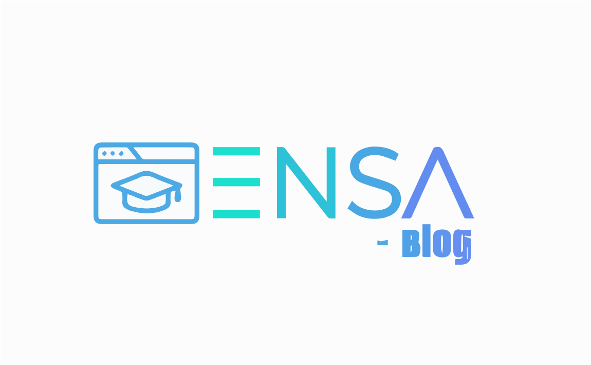

# ENSA - BLOG

## Description

Ensa - Blog is a simple, PHP-powered blogging platform that simplifies content creation and discovery. It offers a user-friendly interface for writers to share their stories and for readers to explore a diverse range of posts. Join the Ensa community to connect with passionate writers and discover engaging content.

## Getting Started

Follow these steps to get your project up and running on your local machine using WAMP.

### Prerequisites

- [WAMP Server](http://www.wampserver.com/) installed on your machine.
- Basic knowledge of navigating through directories via command line or file explorer.

### Installation

1. **Download the Project:**
   - Clone or download the project repository to your local machine.

2. **Move the Project Files:**
   - Copy the downloaded project files to the `www` directory of your WAMP installation.
     - Default location for WAMP's `www` directory: `C:\wamp64\www\`

3. **Start WAMP Server:**
   - Open the WAMP application.
   - Ensure that the WAMP icon in the system tray is green, indicating that the server is running.

4. **Access the Project:**
   - Open your web browser and navigate to `http://localhost/your-project-folder-name`.
   - Replace `your-project-folder-name` with the name of the folder where you copied the project files.

### Additional Configuration
  - Access phpMyAdmin via `http://localhost/phpmyadmin`.
  - Import the SQL file, named "blog.sql" .

Feel free to customize this README to better fit your project's needs. Happy coding!

### Live Demo
http://ensa-blog-beta.wuaze.com/

